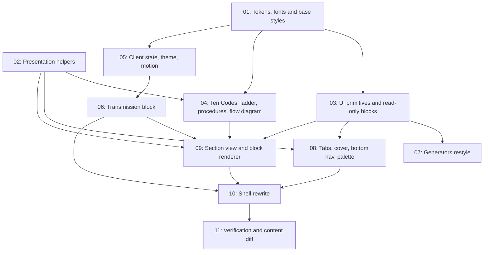

# Field Manual Restyle

## Overview

`Wiki-LSSD` serves the *LSSD Deputy Pocketbook*, a Los Santos Sheriff Department roleplay handbook
(Indonesian content, "Handbook by Brian Putra") as a Next.js 16 App Router app. Today it is a single
scrolling page with a 264px accordion sidebar, a scroll-spy, a hero with three stat boxes, and 37
sections stacked in one column.

This feature replaces **only the presentation layer** with a "Field Manual" structure: a title-page
cover, a book-index tab strip, chapter pages with a margin-note column, restyled read-only components
(Ten Codes, transmissions, rank ladder, procedures, weapons, penal reference), a command palette, a
mobile bottom nav, and restyled generators. Every word of content, every route and anchor, and the
logic of both generators stay byte-identical.

The structural insight the whole spec rests on: **a "chapter" is a category.** The data has 7
categories holding 37 sections, so chapters are numbered `01`–`07` and the sections inside each render
as 26px headings. This is what makes the table of contents line up 1:1 with the chapters.

The content guarantee is enforced structurally: **no file under `lib/` is modified by any task.** All
content, data and generator logic live there, so an empty `git diff --stat lib/` proves nothing moved.

## Quick Links

- [Requirements](./requirements.md) — full requirements, acceptance criteria, and the frozen interface contract
- [Action Required](./action-required.md) — manual steps needing human action

## Dependency Graph

## Waves

| Wave | Tasks | Description |
|------|-------|-------------|
| 1 | task-01, task-02 | Foundations: the token sheet + fonts, and the pure data→presentation helpers every other task reads from. |
| 2 | task-03, task-04, task-05 | Leaf modules built against the frozen token names and interface contract: restyled UI primitives + read-only blocks, the four dedicated components, and the client state store. |
| 3 | task-06, task-07, task-08 | Independent consumers: the transmission block, the two generators, and the new chrome (tabs, cover, bottom nav, palette). None of these three touch the same file. |
| 4 | task-09 | The section view and block renderer — the only task that edits `BlockRenderer.tsx`, so it runs alone, after task-06 has produced `Transmission`. |
| 5 | task-10 | The shell rewrite that assembles everything and deletes the sidebar and hero. |
| 6 | task-11 | Verification: build, lint, typecheck, tests, and the content/URL/generator proofs. |

**Why task-09 is not in wave 3:** it is the sole editor of `components/BlockRenderer.tsx` and it imports
`Transmission` from task-06. Both constraints force it after wave 3, so it sits in wave 4 on its own.
Task-06 deliberately leaves `components/RadioCall.tsx` in place for task-09 to delete, which keeps the
tree buildable at every point.

## Task Status

### Wave 1
- [x] [task-01-tokens-and-fonts](./tasks/task-01-tokens-and-fonts.md) — Additive tokens, 2–3px radius, four new fonts, print stylesheet
- [x] [task-02-presentation-helpers](./tasks/task-02-presentation-helpers.md) — Chapter/category derivation, hash resolution, tier labels, penal row splitting

### Wave 2
- [x] [task-03-ui-and-readonly-blocks](./tasks/task-03-ui-and-readonly-blocks.md) — Hairline primitives and all read-only content blocks
- [x] [task-04-dedicated-components](./tasks/task-04-dedicated-components.md) — Ten Codes, rank ladder, procedures, inline SVG flow diagram
- [x] [task-05-client-state-theme-motion](./tasks/task-05-client-state-theme-motion.md) — Callsign/language store, theme toggle, motion trim

### Wave 3
- [x] [task-06-transmission-block](./tasks/task-06-transmission-block.md) — Radiocall rendered as a transmission with placeholder chips and EN/ID
- [x] [task-07-generators-restyle](./tasks/task-07-generators-restyle.md) — Charge sheet and report output tabs, logic untouched
- [x] [task-08-chrome-components](./tasks/task-08-chrome-components.md) — Tab strip, cover + TOC, bottom nav, command palette

### Wave 4
- [x] [task-09-section-view-and-renderer](./tasks/task-09-section-view-and-renderer.md) — 26px headings, 220px margin column, block routing

### Wave 5
- [x] [task-10-shell-rewrite](./tasks/task-10-shell-rewrite.md) — Header band, category routing, assemble the shell, delete Sidebar/Hero

### Wave 6
- [x] [task-11-verification](./tasks/task-11-verification.md) — Build, lint, typecheck, tests, and the three proofs
