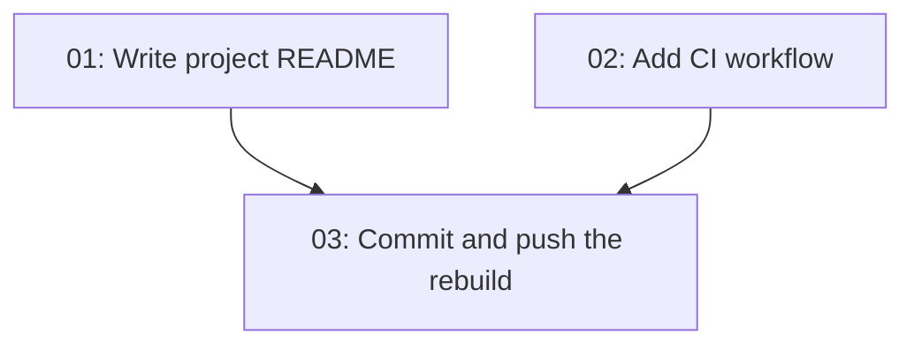

# Ship the Next.js Rebuild

## Overview

The LSSD Deputy Pocketbook has been rebuilt from a vanilla JS static site into a Next.js 16 App Router application with React 19, TypeScript, and Tailwind v4. The rebuild is **complete and verified** in the working tree — typecheck, lint, 7/7 BBCode parity tests, a static production build, and 25/25 browser checks all pass.

What remains is **shipping it**. Nothing is committed yet: 6 tracked files are deleted, `package.json` is modified, and 14 paths are untracked (13 from the rebuild, plus this spec folder). The GitHub Pages workflow that used to deploy this repo was deleted as part of the rebuild and has no replacement, so the repository currently has no automated deployment and no CI. There is also no README.

This spec covers the delivery work only: document the project, add a CI check to replace the removed Pages workflow, and commit/push the rebuild so it can be connected to Vercel.

## Quick Links

- [Requirements](./requirements.md) — full requirements and acceptance criteria
- [Action Required](./action-required.md) — manual steps needing human action

## Dependency Graph

## Waves

| Wave | Tasks | Description |
|------|-------|-------------|
| 1 | task-01, task-02 | Write the two missing artifacts (README, CI workflow). Both create new files; neither touches the other's paths. |
| 2 | task-03 | Commit the entire rebuild — including the two new files from Wave 1 — and push to `origin/main`. Serialized because git operations cannot run in parallel. |

## Task Status

### Wave 1
- [ ] [task-01-write-readme](./tasks/task-01-write-readme.md) — Document the project: quick start, architecture, content model, BBCode guarantee, deployment
- [ ] [task-02-add-ci-workflow](./tasks/task-02-add-ci-workflow.md) — Replace the deleted Pages workflow with a CI check (lint, typecheck, test, build)

### Wave 2
- [ ] [task-03-commit-and-push](./tasks/task-03-commit-and-push.md) — Stage and commit the rebuild, then push to `origin/main`
